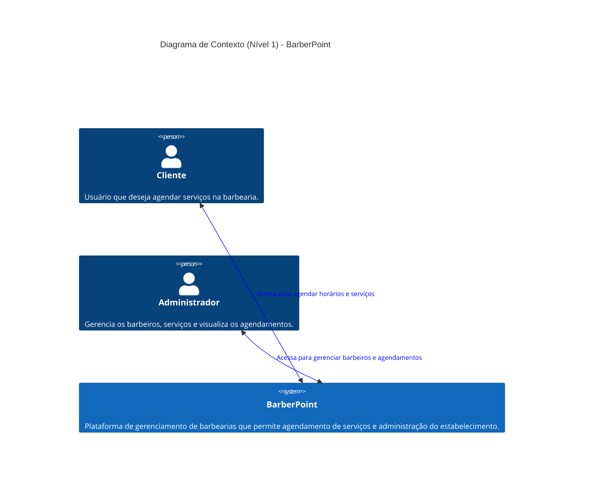
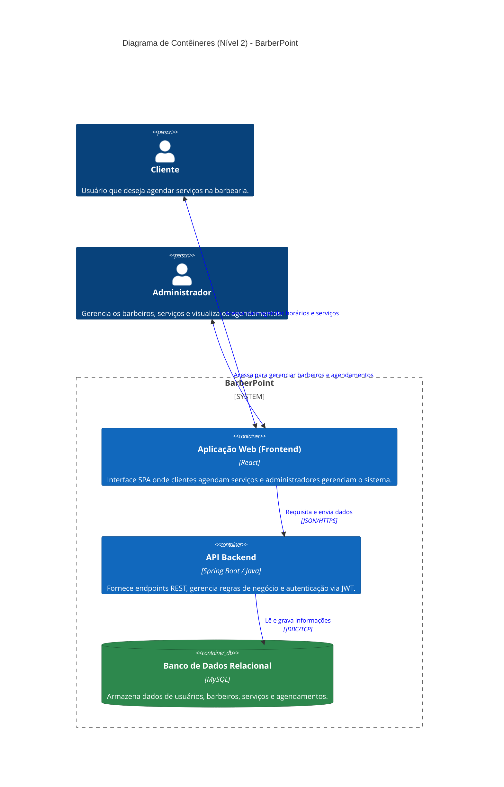

# Introdução e Objetivos {#section-introduction-and-goals}

As barbearias recebem em torno de *x* clientes por dia e, geralmente, os donos gerenciam os horários em uma agenda física.

A fim de melhorar esse fluxo — evitando perda de horários, demora na gestão e falhas operacionais — criamos o app **BarberPoint**.  
Ele tem como objetivo permitir que barbeiros gerenciem suas agendas de forma digital, simples e confiável.

## Visão Geral dos Requisitos {#_visão_geral_dos_requisitos}

### Requisitos Funcionais (RF)

- **RF01**: Permitir cadastro e autenticação de barbeiros.
- **RF02**: Permitir cadastro de clientes.
- **RF03**: Permitir criação, edição e cancelamento de agendamentos.
- **RF04**: Exibir agenda diária/semanal com horários disponíveis e ocupados.
- **RF05**: Registrar histórico básico de atendimentos.
- **RF06**: Permitir busca/filtragem de agendamentos por cliente e data.

### Requisitos Não Funcionais (RNF)

- **RNF01 (Usabilidade)**: Interface simples para uso rápido durante a rotina da barbearia.
- **RNF02 (Disponibilidade)**: Sistema acessível durante o horário comercial sem interrupções frequentes.
- **RNF03 (Desempenho)**: Operações comuns (abrir agenda, salvar agendamento) com resposta rápida.
- **RNF04 (Segurança)**: Dados de usuários protegidos por autenticação e controle de acesso.
- **RNF05 (Manutenibilidade)**: Código organizado para facilitar evolução do produto.
- **RNF06 (Portabilidade Técnica)**: Compatível com arquitetura híbrida (frontend em JavaScript/HTML/CSS e backend em Java).

## Objetivos de Qualidade {#_objetivos_de_qualidade}

- **Confiabilidade**: reduzir erros de marcação e conflitos de horários.
- **Eficiência operacional**: reduzir tempo gasto com gestão manual de agenda.
- **Usabilidade**: minimizar curva de aprendizado para barbeiros e atendentes.
- **Escalabilidade funcional**: permitir inclusão futura de notificações, pagamentos e relatórios.
- **Segurança**: proteger dados de clientes e informações da agenda.
- **Evolução técnica**: facilitar manutenção em uma base com múltiplas tecnologias.

## Partes Interessadas {#_partes_interessadas}

| Função/Nome | Contato | Expectativas |
| :--- | :--- | :--- |
| Dono da barbearia | Administração local | Controle completo da agenda e operação diária |
| Barbeiros | Equipe interna | Visualizar e gerenciar horários com agilidade |
| Recepção/Atendimento | Equipe interna | Agendamento rápido e redução de erros |
| Clientes finais | Canal de atendimento | Facilidade para marcar e confirmar horários |
| Time de desenvolvimento | Repositório / issues | Base técnica estável e de fácil manutenção |

# Restrições Arquiteturais {#section-architecture-constraints}

- O sistema deve operar em ambiente web e ser adaptável para uso móvel.
- A solução deve priorizar simplicidade de uso e baixo atrito operacional.
- A arquitetura deve permitir evolução incremental sem grandes refatorações.
- O projeto utiliza stack híbrida com:
  - **JavaScript (54.5%)** para lógica de interface e integração no frontend;
  - **Java (27.4%)** para serviços de aplicação/backend;
  - **CSS (14.1%)** e **HTML (2.2%)** para camada de apresentação;
  - **Shell (1.8%)** para scripts de automação/configuração.
- O armazenamento de dados deve garantir consistência de agendamentos.
- Dependências externas devem ser minimizadas para reduzir custo e risco operacional.

# Contexto e Escopo {#section-context-and-scope}

## Contexto Negocial {#_contexto_negocial}

**Visão de negócio (alto nível)**

- **Entrada principal**: solicitações de agendamento, alteração e cancelamento.
- **Processamento**: validação de disponibilidade e registro de horários.
- **Saída principal**: agenda atualizada para barbeiro/recepção e confirmação ao cliente.

**Interfaces externas de domínio (conceitual)**

- Cliente ↔ Atendimento (pedido de horário)
- Atendimento/Barbeiro ↔ Sistema (registro e gestão da agenda)
- Dono ↔ Sistema (acompanhamento operacional)

## Contexto Técnico {#_contexto_técnico}

**Visão técnica (alto nível)**

- **Frontend (Web/App)**: implementado com JavaScript, HTML e CSS para operação da agenda.
- **Camada de aplicação/API**: implementada em Java para regras de negócio de agendamento.
- **Persistência de dados**: armazenamento de usuários, clientes e horários.
- **Scripts operacionais**: Shell para automação de tarefas de setup/execução/deploy (quando aplicável).

**Explicação das interfaces técnicas (conceitual)**

- Frontend consome serviços da API.
- API aplica validações (conflito de horário, campos obrigatórios, permissões).
- API persiste e consulta dados na camada de armazenamento.
- Scripts Shell apoiam tarefas operacionais e pipeline local.

**Mapeamento de entrada/saída para canais**

- **Canal App/Web**
  - Entrada: criar/editar/cancelar agendamento, consultar agenda.
  - Saída: confirmação de operação, agenda atualizada, mensagens de erro.
- **Canal Administrativo**
  - Entrada: gestão de equipe e configurações operacionais.
  - Saída: visão consolidada da agenda e status de atendimentos.

---

# Diagrama (Nível 1) - BarberPoint

# Diagrama de Contêineres (Nível 2) - BarberPoint

