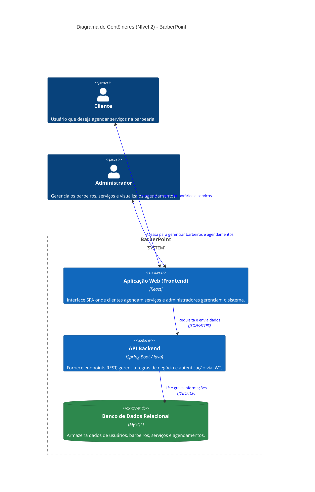

# Diagrama de Contêineres (Nível 2) - BarberPoint

```mermaid
C4Container
      title Diagrama de Contêineres (Nível 2) - BarberPoint

      Person(cliente, "Cliente", "Usuário que deseja agendar serviços na barbearia.")
      Person(admin, "Administrador", "Gerencia os barbeiros, serviços e visualiza os agendamentos.")

      System_Boundary(b_barberpoint, "BarberPoint") {
        
        Container(frontend, "Aplicação Web (Frontend)", "React", "Interface SPA onde clientes agendam serviços e administradores gerenciam o sistema.")
        Container(backend, "API Backend", "Spring Boot / Java", "Fornece endpoints REST, gerencia regras de negócio e autenticação via JWT.")
        ContainerDb(database, "Banco de Dados Relacional", "MySQL", "Armazena dados de usuários, barbeiros, serviços e agendamentos.")
        
      }

      BiRel(cliente, frontend, "Acessa para agendar horários e serviços")
      BiRel(admin, frontend, "Acessa para gerenciar barbeiros e agendamentos")
      
      Rel(frontend, backend, "Requisita e envia dados", "JSON/HTTPS")
      Rel(backend, database, "Lê e grava informações", "JDBC/TCP")

      %% Customização de Estilos
      UpdateElementStyle(frontend, $fontColor="white", $bgColor="#1168bd", $borderColor="#0b4884")
      UpdateElementStyle(backend, $fontColor="white", $bgColor="#1168bd", $borderColor="#0b4884")
      UpdateElementStyle(database, $fontColor="white", $bgColor="#2d884d", $borderColor="#1a522e")

      %% Customização de Setas
      UpdateRelStyle(cliente, frontend, $textColor="blue", $lineColor="blue", $offsetX="10")
      UpdateRelStyle(admin, frontend, $textColor="blue", $lineColor="blue", $offsetX="-10")
      UpdateRelStyle(frontend, backend, $textColor="blue", $lineColor="blue", $offsetX="10")
      UpdateRelStyle(backend, database, $textColor="blue", $lineColor="blue", $offsetX="10")

      %% Configuração de Layout
      UpdateLayoutConfig($c4ShapeInRow="3", $c4BoundaryInRow="1")
```
